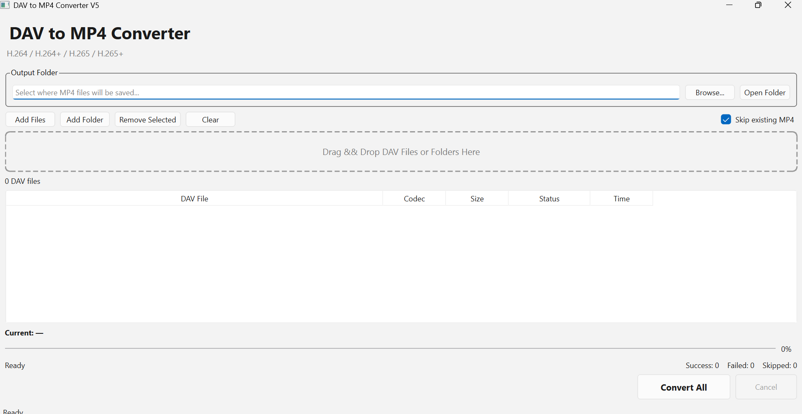

# DAV-to-MP4-Converter

A Windows desktop application for converting CCTV/NVR `.dav` video recordings to standard `.mp4` files.

The application automatically detects H.264 or H.265 video streams inside DAV files, extracts the video stream, and uses FFmpeg to remux it into an MP4 container without re-encoding.

## Features

- Convert `.dav` recordings to `.mp4`
- Support for H.264
- Support for H.264+
- Support for H.265 / HEVC
- Support for H.265+
- Automatic codec detection
- Batch file conversion
- Drag and drop DAV files
- Add individual files or entire folders
- Custom output folder selection
- Skip existing MP4 files
- File size display
- Conversion progress tracking
- Conversion time display
- Background conversion using QThread
- Double-click converted files to open them
- FFmpeg stream copy without video re-encoding
- Standalone Windows executable support with PyInstaller

## Screenshot



## How It Works

DAV is commonly used as a proprietary recording container by CCTV and NVR systems.

This application detects the underlying H.264 or H.265 video stream, extracts it from the DAV file, and uses FFmpeg to create an MP4 container.

```text
                 DAV File
                    |
                    v
             Codec Detection
                    |
            +-------+-------+
            |               |
            v               v
          H.264           H.265
            |               |
            v               v
       Extract Video   Extract Video
            |               |
            +-------+-------+
                    |
                    v
                 FFmpeg
              Stream Copy
                    |
                    v
                   MP4
```

FFmpeg uses stream copy:

```text
-c:v copy
```

Because the video stream is copied instead of re-encoded, conversion is generally faster and does not introduce additional video quality loss from re-encoding.

## Supported Formats

| DAV Video Format | Status |
|---|---|
| H.264 | ✅ Tested |
| H.264+ | ✅ Tested |
| H.265 / HEVC | ✅ Tested |
| H.265+ | ✅ Tested |

> **Note:** DAV is not a single standardized container format. Different CCTV/NVR manufacturers may implement DAV differently, so compatibility with every DAV file is not guaranteed.

## Requirements

To run the application from source:

- Windows 10/11
- Python 3.11+
- PySide6
- FFmpeg

Install the required Python packages:

```powershell
python -m pip install -r requirements.txt
```

## FFmpeg Setup

FFmpeg is required to generate the final MP4 file.

Download FFmpeg and place `ffmpeg.exe` inside the following directory:

```text
DAV-to-MP4-Converter/
│
├── main.py
├── converter.py
│
└── ffmpeg/
    └── ffmpeg.exe
```

FFmpeg is not included in this repository.

## Running from Source

Run the application with:

```powershell
python main.py
```

Then:

1. Add DAV files or drag them into the application.
2. The application automatically detects the video codec.
3. Select an output folder.
4. Click **Convert All**.
5. Wait for the conversion to complete.
6. Open the generated MP4 file.

## Project Structure

```text
DAV-to-MP4-Converter/
│
├── main.py
├── converter.py
├── README.md
├── requirements.txt
├── .gitignore
│
├── assets/
│   └── screenshot.png
│
└── ffmpeg/
    └── README.md
```

### `main.py`

Contains the PySide6 graphical user interface and application logic, including:

- File and folder selection
- Drag and drop
- Codec display
- Conversion progress
- Background conversion
- Conversion statistics
- Output file handling

### `converter.py`

Contains the DAV processing and video conversion logic, including:

- H.264 detection
- H.265 / HEVC detection
- NAL unit processing
- Video stream extraction
- FFmpeg integration
- MP4 remuxing

## Building the Windows Application

The application can be packaged using PyInstaller so that end users do not need to install Python or PySide6.

Install PyInstaller:

```powershell
python -m pip install pyinstaller
```

### One-Folder Build

```powershell
python -m PyInstaller --noconfirm --clean --windowed --onedir --name DAVConverter --add-binary "ffmpeg\ffmpeg.exe;ffmpeg" main.py
```

The generated application will be located at:

```text
dist/
└── DAVConverter/
    ├── DAVConverter.exe
    └── _internal/
```

When distributing the one-folder build, the entire `DAVConverter` folder must be provided.

### One-File Build

To create a single executable:

```powershell
python -m PyInstaller --noconfirm --clean --windowed --onefile --name DAVConverter --add-binary "ffmpeg\ffmpeg.exe;ffmpeg" main.py
```

The generated executable will be:

```text
dist/
└── DAVConverter.exe
```

## Current Limitations

- Audio extraction is not currently supported.
- DAV implementations may vary between manufacturers.
- Compatibility with every DAV format is not guaranteed.
- Some manufacturer-specific DAV files may require additional parsing.
- Frame-rate detection can be improved.

## Future Improvements

Planned improvements include:

- Audio extraction and audio/video synchronization
- Automatic frame-rate detection
- Improved DAV packet parsing
- Support for additional DAV variants
- More detailed video metadata
- Improved cancellation of active conversions
- Application icon
- Windows installer

## Technologies

- Python
- PySide6 / Qt
- FFmpeg
- H.264 / AVC
- H.265 / HEVC
- PyInstaller

## Disclaimer

This project is intended for converting video recordings that the user is authorized to access and process.

DAV is a proprietary recording format used by various surveillance systems. Internal DAV structures may differ between manufacturers and devices.

## License

See the `LICENSE` file for license information.
